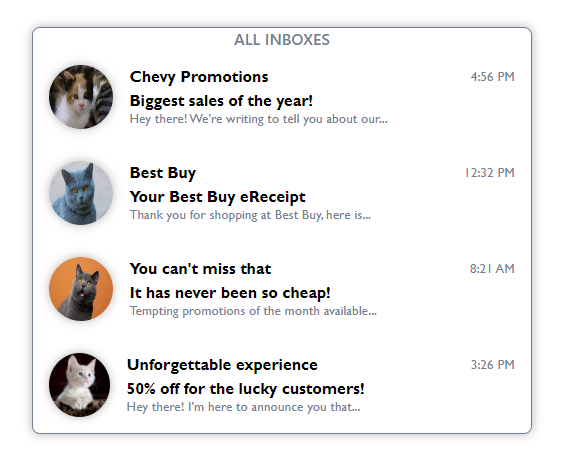
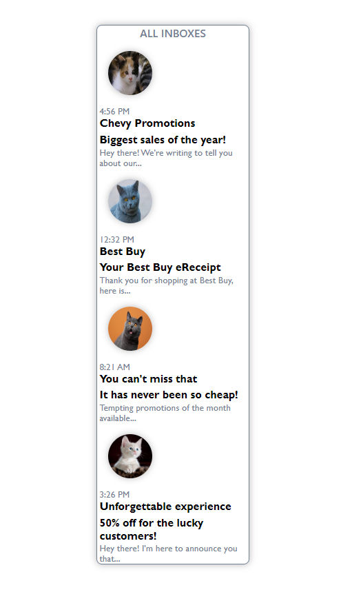

# Catty Inbox:

The goal is to create a visually appealing and functional layout similar to an email inbox using HTML and CSS.

The purpose of this exercise is to practice structuring HTML content and styling it using CSS.

  

  

