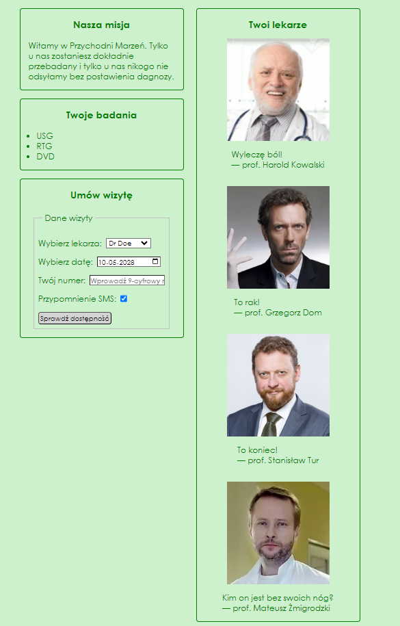
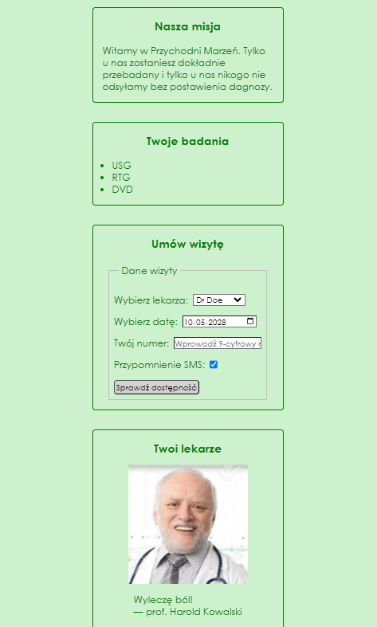

# Przychodnia Marzeń:

The purpose of this exercise was to create the structure of a clinic website named "Przychodnia Marzeń" It includes sections for displaying the clinic's mission, available medical tests, and a form for scheduling appointments. Additionally, it showcases profiles of several doctors.

  

The layout is organized using flexbox, with the main content displayed in rows on larger screens and in columns on smaller screens.

  

The form for scheduling appointments includes input fields for selecting a doctor, choosing a date, entering a phone number, and opting for SMS reminders. The form submission button has a light gray background with black text, creating a subtle appearance.
