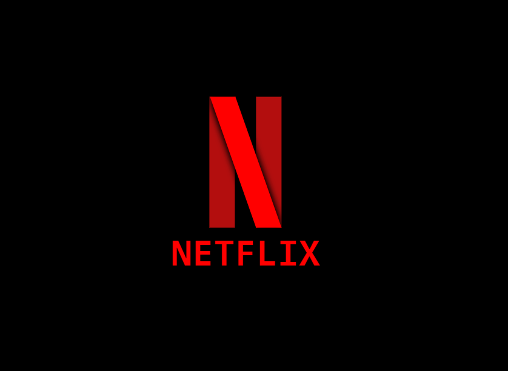

# Netflix Logo:

The goal of this exercise is to replicate the Netflix logo using HTML, CSS and a bit of JavaScript.

This exercise aims to enhance understanding of layout positioning, CSS styling techniques, and basic JavaScript for interactivity.

  

