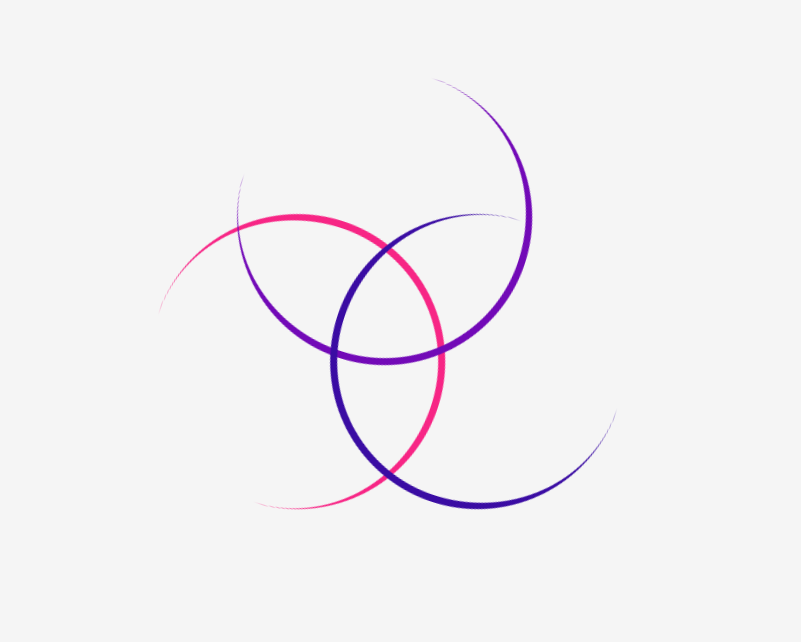
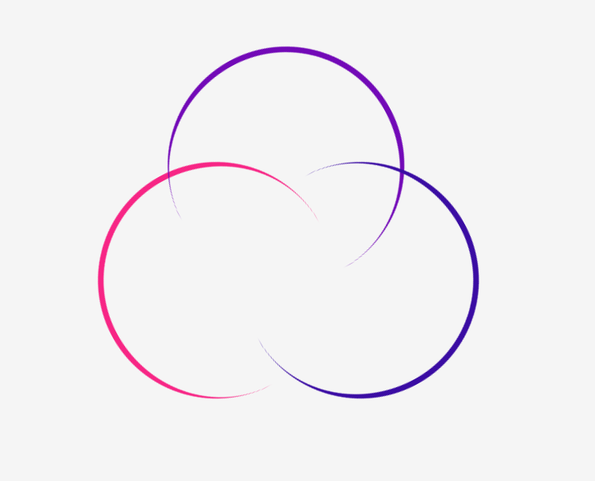

# Loading Rings:

The objective of this exercise is to create a simple loading animation using HTML, CSS and a bit of JavaScript.

The animation consists of three concentric rings rotating in a synchronized manner, providing a visually engaging loading indicator.

  

  

