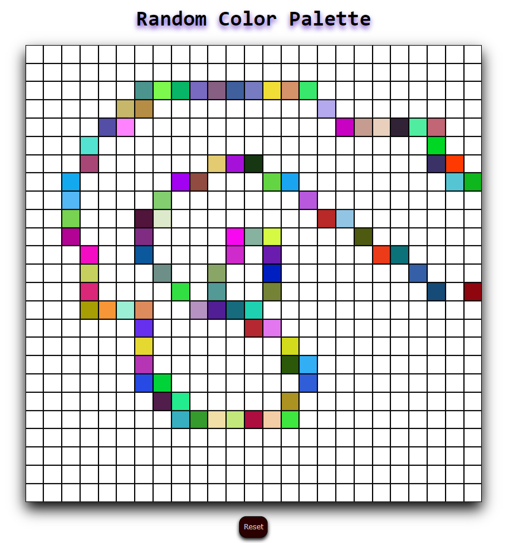
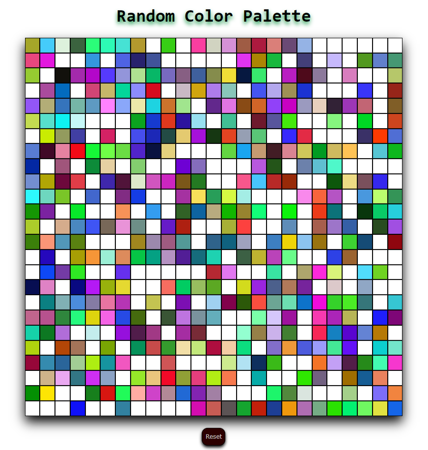

# Random Color Palette:

The goal of this exercise is to create a fun and interactive web application that generates a random color palette.

Users can click on a button to reset the color palette with a new set of random colors. This project incorporates HTML, CSS, and JavaScript to create an engaging user experience.

Hovering mouse over the squares of a grid changes colors of the palette.

  

  

