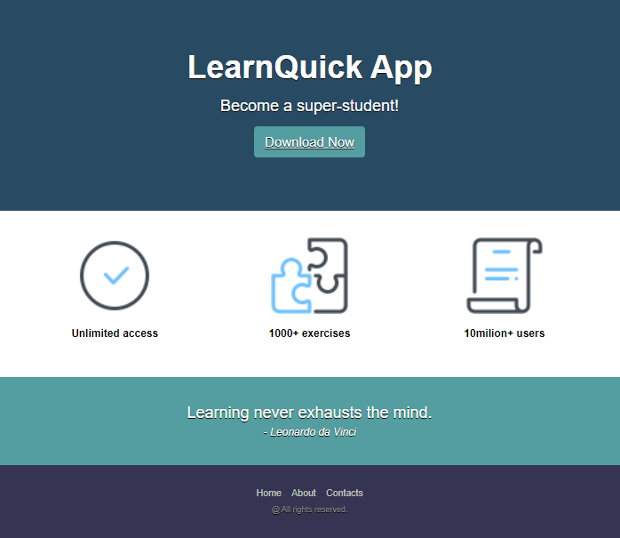
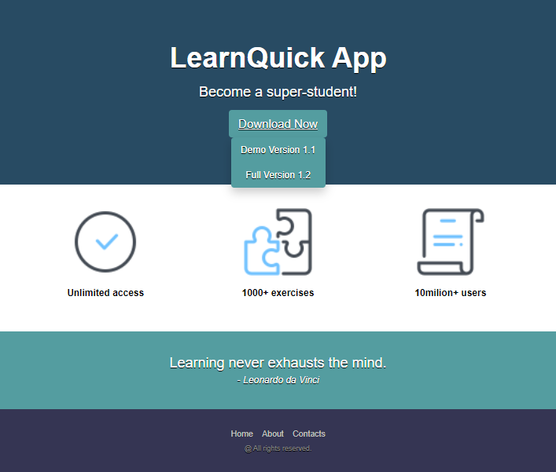

# LearnQuick:

The exercise involves creating a web interface for a fictional application called "LearnQuick."
The interface includes a header with a title, a subtitle, a download button, and a submenu.

  

The submenu is initially hidden and becomes visible when the download button is clicked, thanks to a jQuery slide toggle effect.

  

