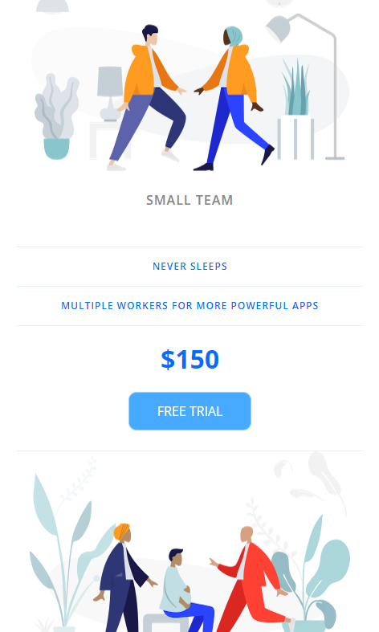

# Price Tiers:

This exercise involves creating a pricing plan interface for a service called "Price Tiers." The HTML markup defines three pricing plans: Personal, Small Team, and Enterprise. Each plan includes features, pricing, and a call-to-action button.

The plans are styled using CSS to have a consistent layout and design. Each plan is contained within a panel, which is styled to have a white background with rounded corners. The plans are displayed in a row on larger screens and in a column on smaller screens.

  

The CSS defines styles for various elements such as pricing headers, features, prices, and buttons. The pricing features are listed with custom icons, and the pricing button for the Small Team plan is highlighted as a featured plan.

Overall, the exercise focuses on creating a visually appealing and responsive pricing plan interface suitable for different screen sizes.

  

