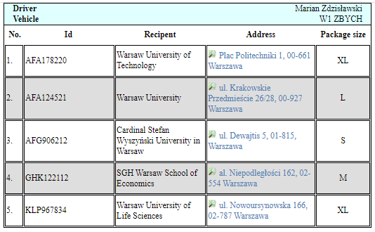

# Shipping Lists:

The purpose of this exercise was to create the layout of the table which includes details of deliveries along with recipient information and addresses.

The layout is structured with a header section for driver and vehicle details, followed by a list of shipments.

The addresses are hyperlinked and styled to resemble buttons, allowing users to open Google Maps in a new tab by clicking on them.

  

The layout adjusts dynamically for smaller screens using media queries, ensuring optimal display on devices with varying screen sizes.
