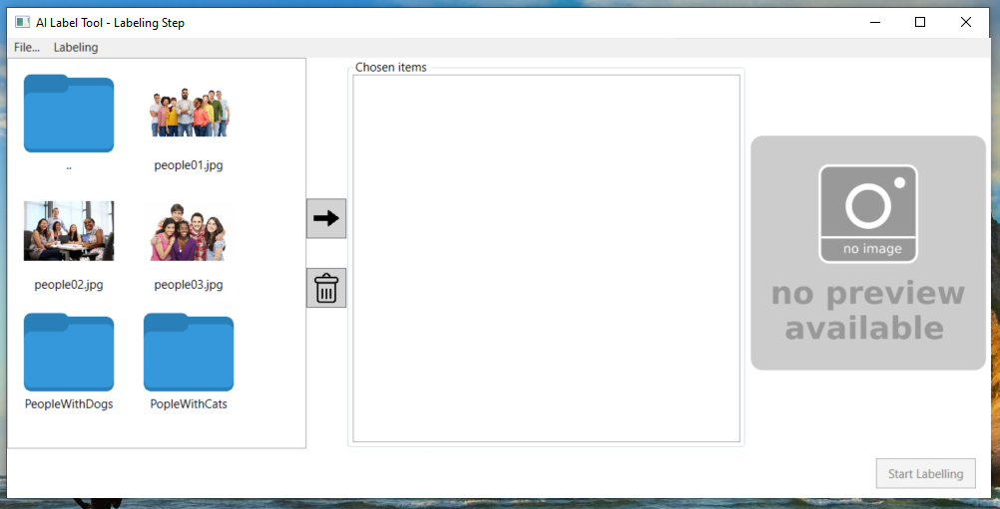
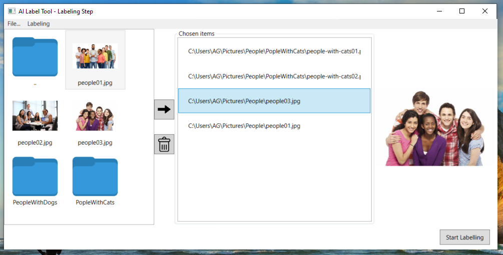
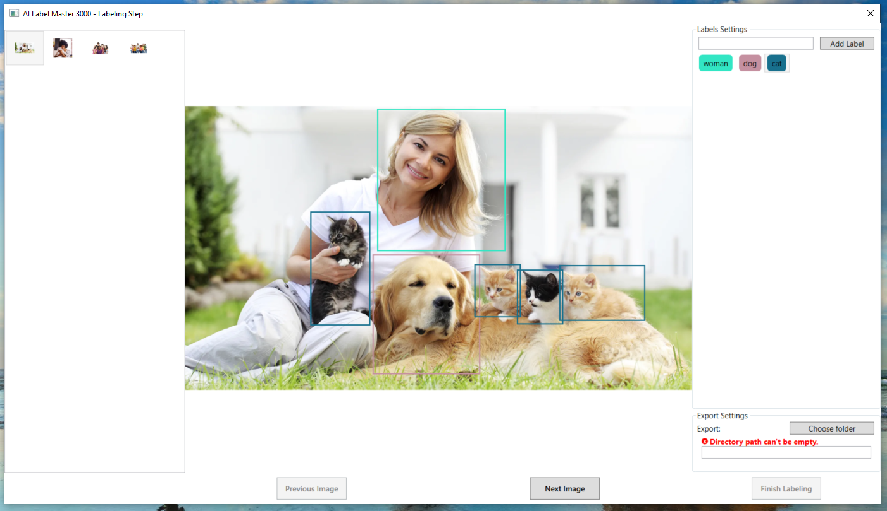
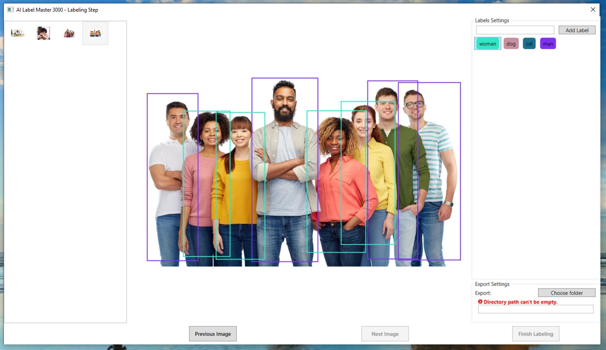
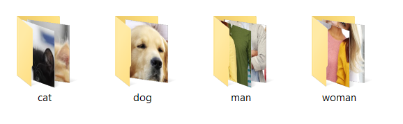

# Image Labelling Tool:

The goal of the project was to create a functioning graphical tool for image labelling using WPF technology.

The project was implemented using data binding, allowing the graphical components to naturally communicate with the internal data structures.

The application consists of two windows.

The first window contains the following elements:

- A file browser enabling the user to select images for the labelling process.
- A list of files pre-selected for the labelling process.
- A preview of the selected image, activated by selecting an entry from the list of pre-selected images.
- Buttons responsible for modifying the list of pre-selected images.
- A button to start the labelling process and open the second (dialog) window.

  

  

The dialog window contains the following elements:

- A list of images selected for the labelling process, displayed as thumbnails of the selected images.
- Buttons for navigating through the list of selected images.
- A list of created labels, which the user can edit by deleting a selected label or renaming it.
- A window for the labelled image, where the user can add examples (as rectangles of specified color) for the active label.
- Export settings group box, allowing the user to choose where to export the labels (into separate folders).

  

  

  

